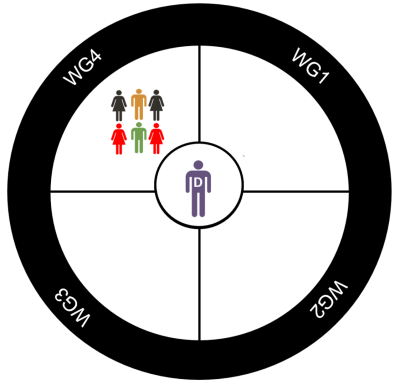

*The process of implementing the Businesses That Care prevention system occurs across 5 Stages (minimum = 10 months; maximum = 20 months) with a series of activities, trainings, and workshops that take about a year to complete.*

#### Stage 1 is “Get Started” which includes:
* Assess community readiness.
* Meet with potential BTC business and community leaders
* Select BTC businesses.
* Obtain memoranda of understanding (MOU) with eligible businesses.
* Recruit Prevention Committee Director.

#### Stage 2 is “Get Organized” which includes:

* Develop the BTC Prevention Committee
* Introduce the Prevention Committee to BTC system and “pre-selected” prevention programs.
* Introduce BTC to the local community.

#### Stage 3 is “Make a Plan” which includes:

* Collect data on risk and protective factors
* Develop an “action plan” based on these data

#### Stage 4 is “Take Action” which includes:

* Implement the action plan
* Deliver the programs to their target audiences.
* Monitor the implementation fidelity of the programs 
* Ensure good communication within the BTC Prevention Committee and with outside community members.

#### Stage 5 is “Take Stock” which includes:

* Evaluate the impact of programs on their target populations.
* Make adjustments based on evaluation results.
* Prepare for the next “round” of BTC activities.
* Make sure that the BTC system is sustainable in the long-run.

---

Stage 1: Get Started (1 to 2 months)

---

Stage 2: Get Organized (2 to 4 months)

---

Stage 3: Make a Plan (1 to 2 months)

---

Stage 4: Take Action (2 to 4 months)

---

Stage 5: Take Stock (3 to 6 months)

---

#### BTC Logic Model (System Integration)

---

---

## Director of the Preventive Committee

The Director is a person trained and specialized in prevention science and specifically in the BTC prevention system. The director is a neutral individual who does not represent any of the participating businesses.

His/her work consists of:

* Maintain a link to the BTC training websites and providing documentation and training 
* materials to the Prevention Committee Workgroups (WGs).
* Coordinate trainings and meetings of the Prevention Committee.
* Act as an intermediary between the BTC company administrative offices (Directors) and the Prevention Committee.
* Review BTC implementation.
* Facilitate the decision-making process in the Prevention Committee.
* Be a liaison with technical assistance groups and the local community.

##### Prevention Committee

We can think of the BTC Prevention Committee Director as the conductor of an orchestra. He/she doesn’t play a musical instrument but knows each instrument well and makes sure that all instruments are played in harmony.

---

###  Workgroup 1 (WG1): Implementation

The Implementation Workgroup consists group of 4 to 6 workers from the participating BTC companies who have an interest in delivering prevention programs to their intended audience.

Their tasks:

* Understand thoroughly the prevention programs that are going to be used in the BTC process.
* Understand what implementation fidelity means and how it can be measured.
* Monitor the implementation fidelity of selected programs fidelity data.
* Monitor the “consumer satisfaction” of prevention program participants. 
* Identify any implementation-related bottlenecks or problems in delivering programs to the target population.
* Facilitate child-care needs for children of families attending prevention program sessions
* Help with transportation to and from program sessions.
* Provide refreshments for meetings as warranted.
* Interact with other Workgroups as needed.

---

## Workgroup 2 (WG2): Internal Communications

The Internal Communications Workgroup consists group of 4 to 6 workers from the participating BTC companies who have good communication skills and an interest in the internal structures and personnel of participating BTC companies.

Their tasks:

* Responsible for recruitment of employees and their families into selected prevention programs.
* Screen employees for program participation to assure appropriate program exposure to target population.
* Interact with program facilitators/trainers and company Human Resources regarding the scheduling of program sessions.
* Maintain communication flow of all BTC activities among all Prevention Committee Workgroups.
* Interact with the Directors Advisory Board and other Workgroups as needed.

---

## Workgroup 3 (WG3): External communications

The External Communications Workgroup consists of 4 to 6 workers from the participating BTC companies who have good communication skills and an interest in working with the larger community to share information regarding BTC system needs, activities, and accomplishments.

Their tasks:

* Maintain communication (dissemination) and resource sharing (e.g., data) with the governmental agencies, external organizations, and non-BTC private businesses.
* Identify opportunities to expand the reach of selected programs into the community.
* Assess resources (including financing) in the community to support BTC activities and goals.
* Work with local media in the dissemination of BTC activities and accomplishments with the local community.
* Meet with the local Community Advisory Board for information exchange.
* Interact with other Workgroups as needed.

--- 

### Workgroup 4 (WG4): Data Analysis Workgroup

The Data Analysis Workgroup consists group of 4 to 6 workers from the participating BTC companies who have good analytic or math skills and an interest in working with data.

Their tasks:

* Take responsibility for collecting risk and protective factor data from employees, parents, and/or youth as possible.
* Analyze risk/protective factor data for development of Action Plan.
* Analyze implementation monitoring data to assure fidelity.
* Plan for repeated administrations of risk/protective factor and outcome data for evaluation of program effectiveness.
* Share data analysis with Internal and External Communications Workgroups for dissemination within and without BTC Prevention Committee.
* Interact with other Workgroups as needed.

---

## BTC Prevention Committee Summary

**Prevention Committee Director:** Received specialized training in prevention science and the BTC prevention system. Maintains link to BTC website and provided necessary training documentation to workgroups. Coordinates workshops, trainings, and Prevention Committee meetings. Acts as conduit between company administration and the Prevention Committee. Reviews Milestones and Benchmarks Implementation Tool to monitor BTC implementation.  Facilitates decision-making within the Prevention Committee. Acts as liaison with Trainers and Technical Assistance providers. Workgroups meet as needed; however, at least once per month is recommended.

**Workgroup 1 (Implementation):** Reviews existing literature and documentation on recommended programs to be implemented in Business. Monitors implementation fidelity data and consumer satisfaction data. Relates bottlenecks or implementation-related problems to the Prevention Committee Director and other Workgroups.

**Workgroup 2 (Internal Communication):** Is responsible for recruitment of employees and families for family-based program. Is responsible for screening of workers and families with respect to selection criteria.  Interacts with implementers  and company Human Resources regarding scheduling of sessions.  Facilitates day-care needs for children of families attending family-based program sessions. Helps with transportation to and from sessions. Provides refreshments for meetings as warranted. Links to Directors’ Advisory Board for information exchange.

**Workgroup 3 (External Communication): ** Maintains communication (dissemination) and resource sharing (e.g., data) with external organizations and private businesses. Works with external organizations in implementation of selected programs to populations outside of company reach and populations that may take advantage of program implementation within the company. May include Targeted Resource Assessment Taskforce as a sub-group to (annually) assess what other resources exist in the community that could be incorporated to further BTC goals. Links to Community Advisory Board for information exchange.

**Workgroup 4 (Data Analysis):** Takes responsibility for collecting risk and protective factor data from employees, parents, and youth; and analyzing data for program selection  by the full Prevention Committee). Assesses repeated administrations of risk/protective factor and outcome data for evaluation of intervention effectiveness. 

---

## BTC Prevention Committee Summary: System Communication and Information Flow

It is essential to the success of the BTC prevention system that each Workgroup do its part. This means communicating and integrating efficiently with the other Workgroups, the DAB, and the CAB. This figure shows the interdependencies that exist among these groups. 

## Timeline for Expected Community Change for Youth Alcohol Use Prevention

Community-level change for preventing youth alcohol use and misuse takes time and requires a long-term vision. These timelines indicate the minimum amount of time changes in each stage of the process can be expected to be realized.

