# Tomando Buenas Decisiones
Mexican adaptation of the Guiding Good Choices* prevention program

* Six 2-hour session family-based prevention program designed to develop positive family cohesion.
* Adapted for emphasis on youth alcohol use/abuse prevention.
* Focus on targeted risk and protective factors.
* Builds a social network of families for support.
* Offered to employees and their spouses who have children between 8 and 16 years.

Session 1: Drug use prevention in the family.
Session 2: Healthy beliefs and clear standards.
Session 3: How to say no to drugs and alcohol.
Session 4: How to positively express yourself.
Session 5: How to build strong family bonds.
Session 6: Alcohol literacy and expectancies.

*See: www.sdrg.org/ggc.asp

more info: xxx

---

# Aprendiendo dar Habilidades, Oportunidades, y Reconocimiento a Adolecentes (AHORA) 

Mexican adaptation of the Social Development Strategy)

* Environmental prevention strategy based on the Social Development Strategy
* Designed to promote positive social bonds and behaviors
* Provides an operational framework for establishing positive standards and norms through skills, opportunities and recognition
* Offered to all employees of participating BTC companies as an ongoing 2-hour workshop*

Hawkins, J. D., Lishner, D. M., & Catalano, R. F. (1985). Childhood predictors and the prevention of adolescent substance abuse. Etiology of drug abuse: Implications for prevention, 75-126.

--- 

# Familas Unidas 
## Family-based prevention program for Hispanic Families developed at the University of Miami

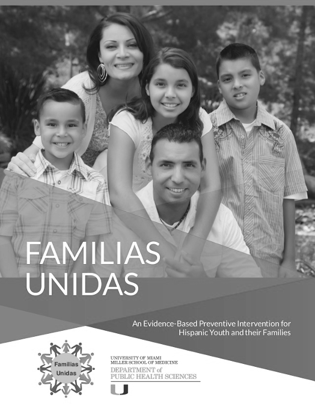
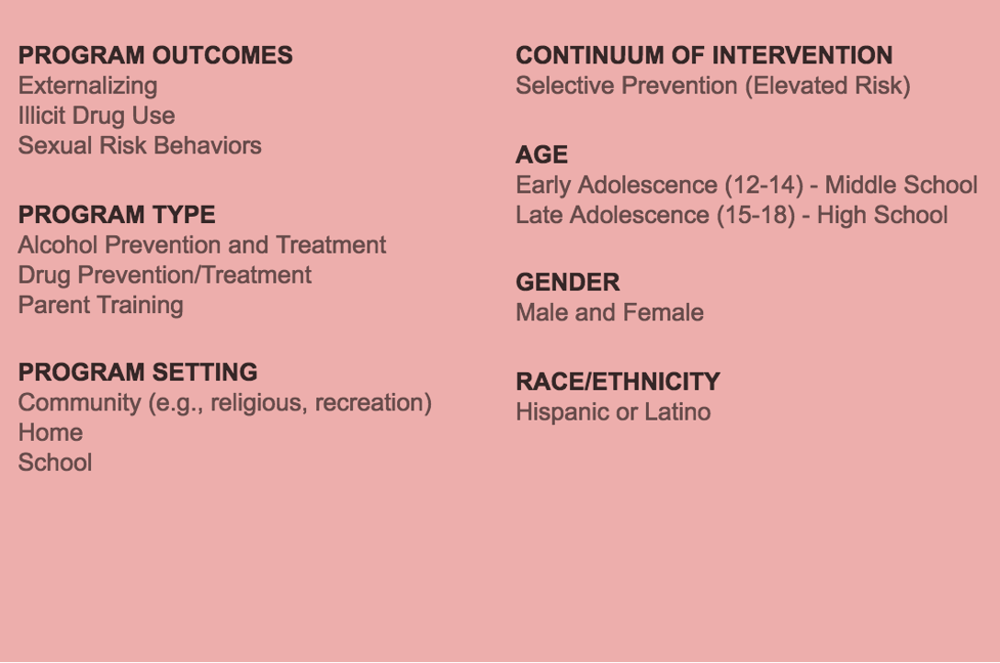
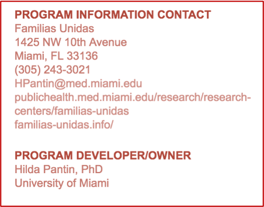

Familias Unidas has been evaluated in 6 randomized trials (Pantin et al., 2003; Prado et al., 2007; Pantin et al., 2009; Prado et al .; 2012; Estrada et al., 2015; Estrada et al., 2017 ).

It has an online version: e-Familias Unidas

8 sessions consisting of "group drills" and soap operas
4 family visits online

Web site : http://familias-unidas.info/

---

# Familas Fuertes 
## Strengthening Families Program. Family-based prevention program developed at the Iowa State University

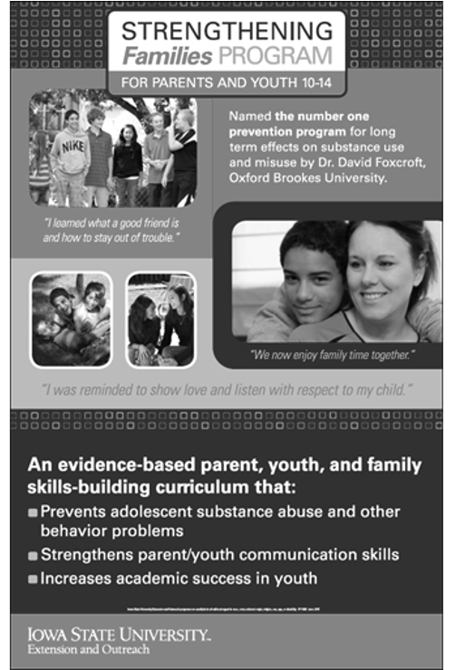
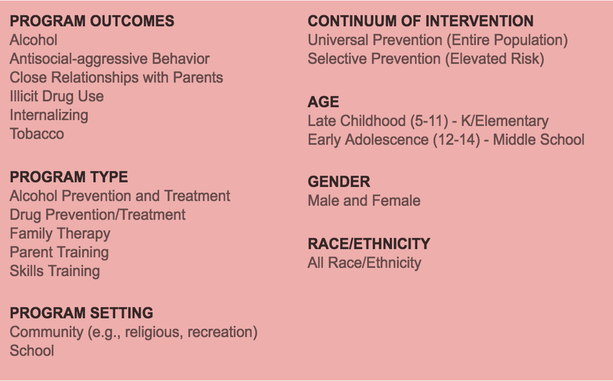
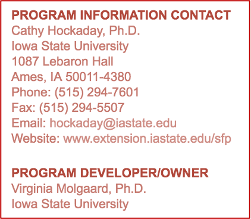

STRENGTHENING FAMILIES 10-14 has been evaluated in several randomized trials (Spoth, et al 2001).

* Lower alcohol use initiation rates
* Lower proportion of initiation reports of each of the five substance use behaviors (alcohol use, alcohol without parental permission, drunkenness, cigarettes, and marijuana) at four-year follow-up (grade 10).
* Slower overall growth in lifetime alcohol use, lifetime cigarette use, and lifetime marijuana use over six years of follow-up (Grade 12).

It has a version in Spanish: Familias Fuertes

21 sessions (7 weeks)

https://www.extension.iastate.edu/sfp10-14/

---

# Mantente REAL (keepin’ it REAL)

(School-based prevention program adapted for Mexico by the Arizona State University)

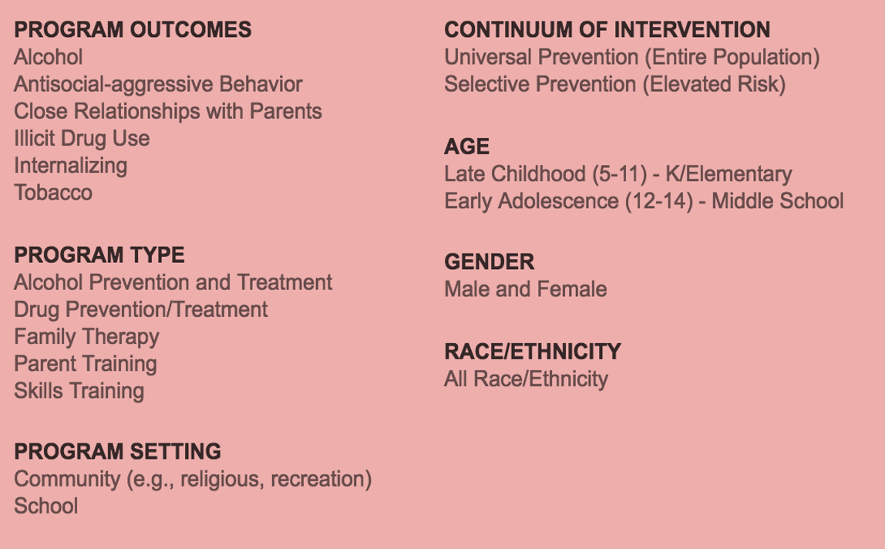
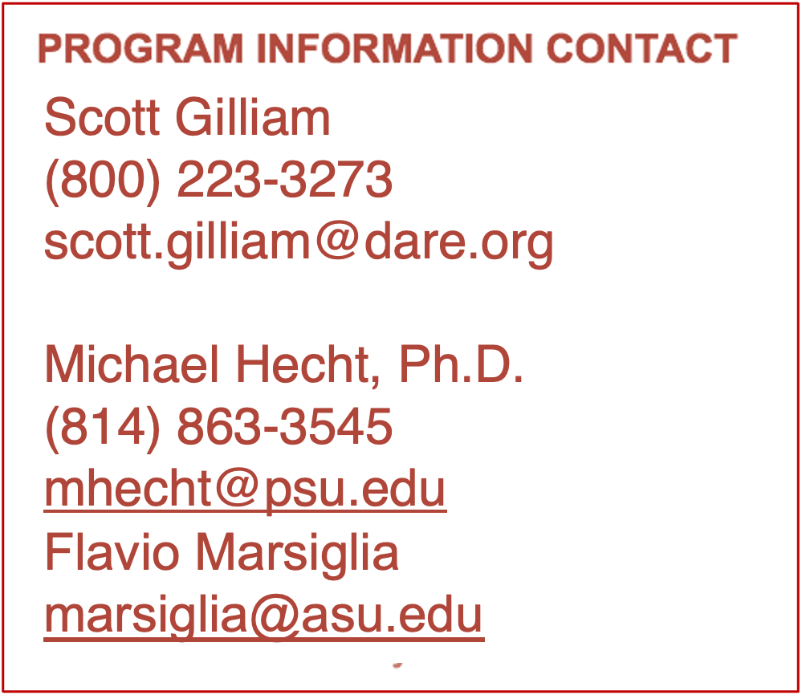
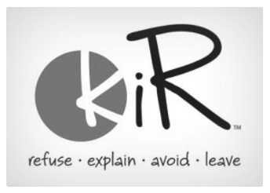

keepin’ it REAL (Mantente REAL in Spanish) has been evaluated in several randomized trials (Hecht et al, 2008; Marsiglia et al, 2015).

Minor use of alcohol, marijuana and cigarettes. The effects lasted up to 14 months for alcohol and marijuana use, and up to 8 months for cigarette use.

32% of the students who reported alcohol use during the initial evaluation reported a discontinuation of such use, compared to 24% of the students in the control group (p <.01).

It has videos in Spanish: Mantente R.E.A.L

10 interactive 45-minute lessons delivered over a 10-week period, including a series of five videos

https://real-prevention.com/keepin-it-real/

---

# Unplugged (School-based prevention program developed at the University of Zagreb, Croatia)

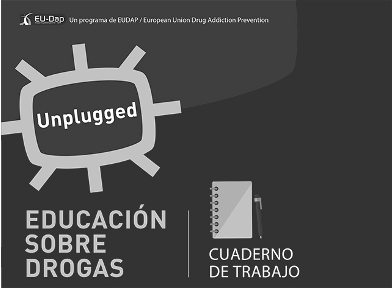
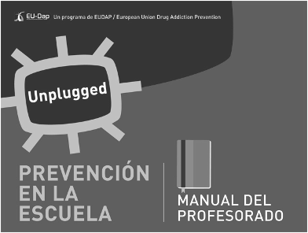
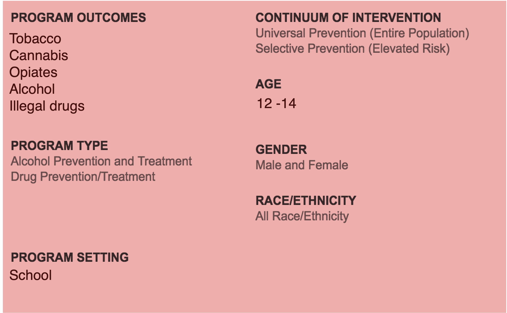
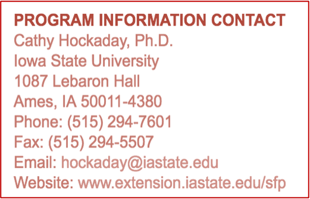

UNPLUGGED has been evaluated in several randomized trials in the EU (Faggiano et al., 2010).

30% reduction in daily tobacco use and episodes of alcohol intoxication
23% reduction in cannabis use
Effects of the program are maintained for at least one year

It has materials in Spanish (Spain version):

10 interactive 45-minute lessons delivered over a 10-week period, including a series of five videos.

http://www.eudap.net/Unplugged_HomePage.aspx

---

# Consentidos
(School-based prevention program by the Colectivo Aqui y Ahora in Colombia)

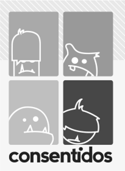
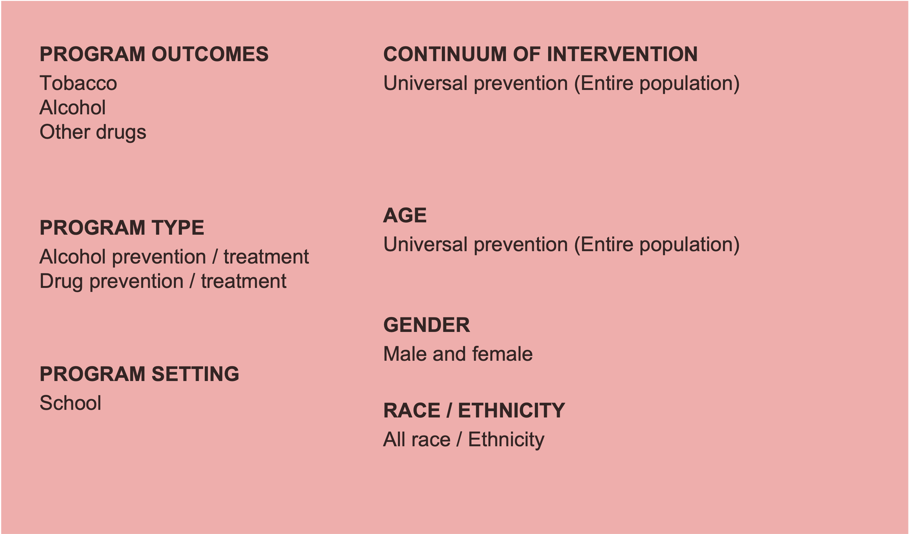
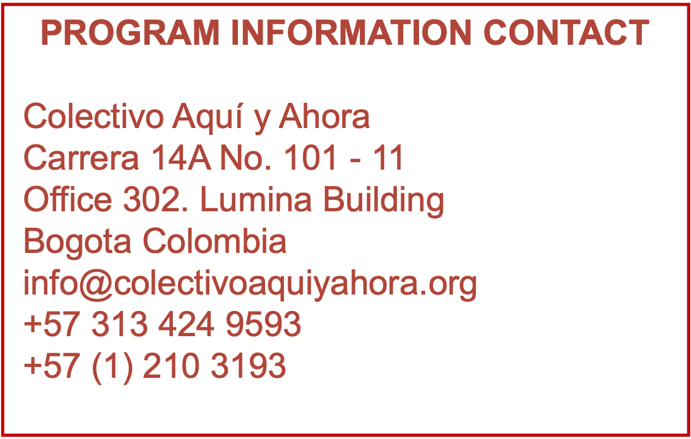

---

# Brief Intervention Motivational Interviewing 

Intervención Breve Entrevista Motivacional, IBEM
Developed by the Corporación Nuevos Rumbos

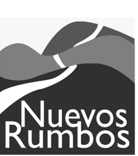

* School-based individualized intervention that focuses on alcohol/drug behaviors and outcome (e.g., frequency, quantity, onset). 
* Based on Prochaska et al. (2005) Transtheoretical Model of Behavior Change.*
* Widely used in Colombia with positive effects.
* Offered to students between 11 and 16 years of age.
* Repeated one-on-one interviews with students at baseline (in person), post six months (telephone), and post 12 months (telephone).
* Identifies student’s risk category and structured goals for problem behavior change.

