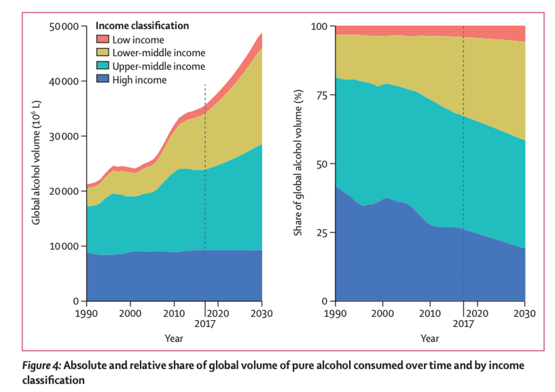
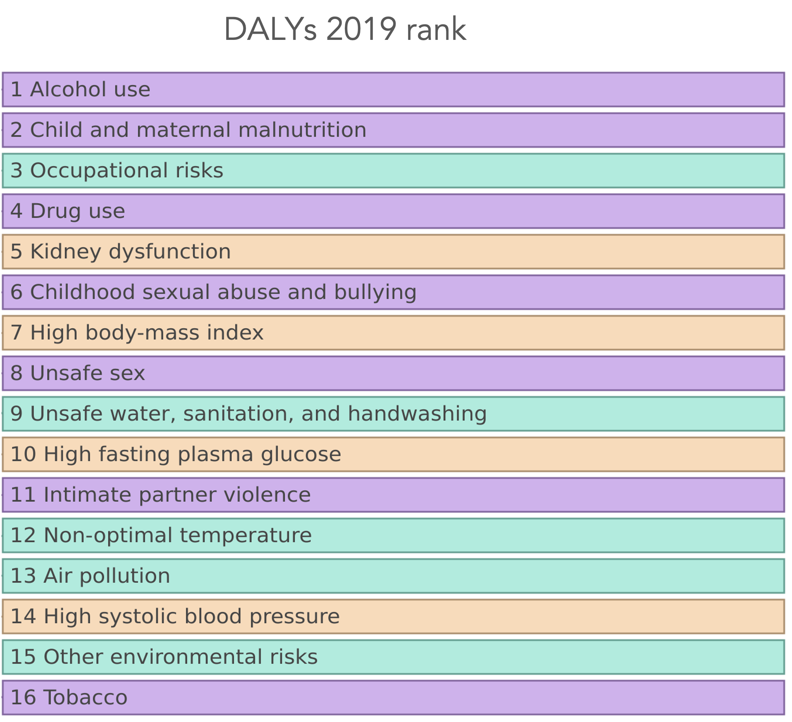
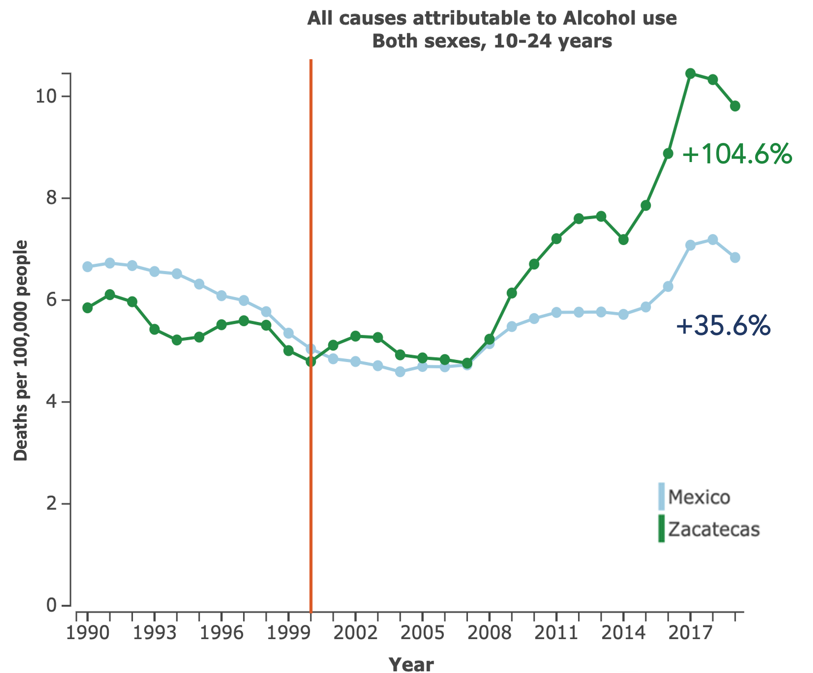

What is the harmful use of alcohol? The harmful use of alcohol is a term coined by the World Health Organization to describe any use of alcohol that causes harm to the drinker, or those surrounding the drinker. It is monitored by levels of alcohol consumption.

#### The Harmful Use of Alcohol

Some key consequences are…

1. **3 million deaths each year, representing 5.3% of all deaths**

1. **200+ diseases and injuries with harmful use of alcohol as causal factor**

1. **~13% of deaths among 20-39 year olds attributed to alcohol**

1. **Causal relationship between harmful drinking and incidence of infectious diseases such as tuberculosis**

1. **Social and economic loss to society**

---

### The Burden of Alcohol

Alcohol use (AU) causes more than 2 million deaths yearly since the year 2000 (IHME, 2020)

Despite alcohol representing a public health concern its use has been increasing by 70% since 1990 – the trend is expected to remain the same until 2030 (Manthey et al., 2019)

In high-income countries, the total volume of alcohol consumed has remained stable, while it has grown in lower and upper middle-income countries (Manthey et al., 2019)

---

### The Burden of Alcohol- Youth & Mexico

Alcohol is the 1st leading causal risk factor for premature death and disability (DALYs) in people 10-24 in LA & Caribbean (IHME, 2020).

In 2019 in Mexico, nearly 50,000 people died from causes related to alcohol, compared with 4,000 who died from causes related to illegal drugs (IHME, 2020).

---

### Youth Alcohol Use - Mexico & Zacatecas

Among Mexican youth 10 to 24 years of age, alcohol-related death rates have increased 35.6% since 2000 (IHME, 2020).

State of Zacatecas has experienced a 104.6% increase in the last two decades (IHME, 2020). 

Exposure: Zacatecas is positioned as the 2nd  Mexican state with the highest prevalence of adolescent binge drinking in the last month (Villatoro-Velázquez, et al., 2017). 

---

### Youth Prevention and the Harmful Use of Alcohol

Research has demonstrated that prosocial environments can impact the harmful use of alcohol such as:

* Impaired driving (i.e., drink driving)

* Binge-drinking

* Underage drinking

* Physical violence

* Alcohol-related mortality

Prevention systems such as BTC address the various domains of alcohol use environments. These domains can be: 

* Peers

* School 

* Family

* Community

---

#### Program-based Approach

Prevention programs are manualized curricula that have been developed to reduce the onset or escalation of health and behavior problems. They are delivered by trained professionals usually in a specific setting (e.g., in schools or with families). 

You can think of prevention programs as apps (e.g., Google Maps, WhatsApp, Instagram, TikTok) on your cell phone—each with a different set of characteristics that allow it to achieve a specific desired result.

There are many examples of effective programs to prevent youth alcohol use. Some examples of well-known programs include Life Skills Training, Positive Action, Familias Unidas, Guiding Good Choices, Nurse Family Partnership, and Raising Healthy Children.

**The choice of which prevention program to use is a difficult and important one. Best practice calls for the use of a prevention system to help guide the selection and implementation of prevention programs.**

*More information on prevention programs and systems can be found at: https://www.blueprintsprograms.org/*

#### Systems-based Approach

Prevention systems are a set of activities and components that are put together in an organized way that allow programs to work together efficiently across multiple settings. Systems allow their component parts to work together in a way that is better than how they work separately.  

You can think of prevention systems as the operating system on your cell phone (e.g., Android or iOS), which allow all your apps to function together synergistically in one environment.

Prevention systems allow for better selection and implementation of prevention programs. They incorporate the local community into prevention activities and rely on the use of local data for science-base decision making. 

There are few examples of prevention systems. The most widely used are Communities That Care (CTC), Promoting School-Community-University Partnerships to Enhance Resilience (PROSPER), the Strategic Prevention Framework (SPF), and Getting to Outcomes (GTO). 

**This toolkit focuses on the use of one specific prevention system—Businesses That Care—along with its implementation of two prevention programs (Tomando Buenas Decisiones and AHORA)—as a best practice for the prevention of alcohol use and misuse among adolescents**

---

