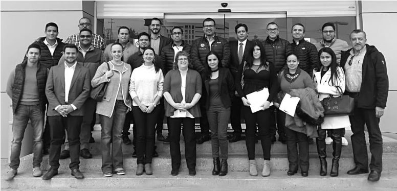
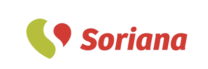
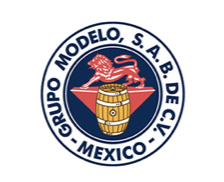
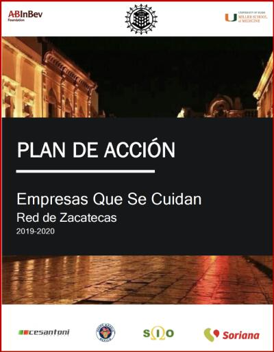
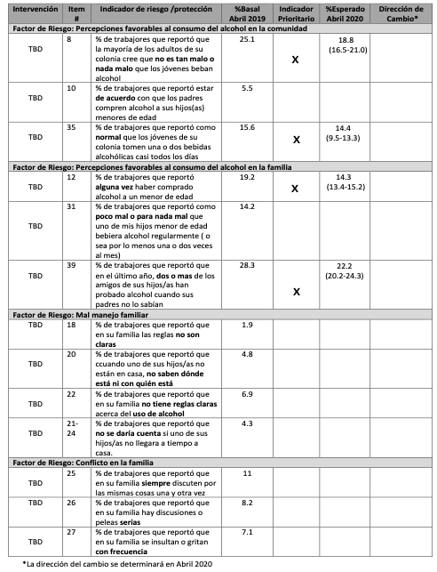
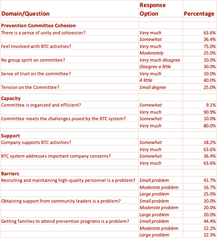

### Background

In 2015, the AB InBev Foundation [(ABIF)](https://abinbevfoundation.org/) launched the [“Global Smart Drinking Goals”](https://www.ab-inbev.com/smart-drinking/smart-drinking-goals/) to reduce by 10% the harms associated with AU in six cities around the world, including Zacatecas, Mexico.

The [University of Miami](https://welcome.miami.edu/) was contacted by ABIF to reduce the existent high prevalence of underage drinking in Zacatecas      (53.2% lifetime alcohol use & 14.5% binge drinking between ages 12 to 17 years) (Villatoro-Velázquez et al., 2017).

After an initial needs assessment of the context, the University of Miami partnered with a local private businesses to develop Businesses That Care (BTC) [(Dr. Eric C. Brown, Principal Investigator)](https://people.miami.edu/profile/ecb41@miami.edu).

The network has committed to support the adaptation and implementation of preventive interventions (EBPIs) under a high-fidelity approach (Montero-Zamora et al., 2021).

  

### BTC Zacatecas Company Recruitment: Pros and Cons

#### Pros:

1. Private companies are not as sensitive to changing political winds or public sector bureaucracy. 
1. Private companies typically have the resources to implement BTC quickly and with good adherence.
1. Fosters positive collaboration among local businesses and with other community sectors (e.g., government, schools, advocacy groups).
1. Demonstration of positive social responsibility by BTC companies.
1. Companies demonstrate care for their employees and their families. Better moral, health, safety, and productivity among workers.
1. Company setting facilitates data collection and delivery of prevention program to workers and their families.

#### Cons:

1. BTC system implementation is complex. Requires time and dedication by companies, their directors, and their workers.
1. Company time is needed to conduct BTC activities and deliver prevention programs to target populations.
1. Unknown if corporate culture is compatible with pluralistic culture of group-decision making in BTC.
1. Logistical, managerial, and cultural adaptations are made “on the fly.”

----

### Business engagement

Obtain Memorandum of Understanding and Commitment Letters from local companies.

---

### BTC Zacatecas Action Plan

Prioritized Risk and Protective Factors and Target Indicators by the BTC Prevention Committee

---

### BTC Zacatecas Prevention Committee Functioning (N = 27)

---

### BTC Zacatecas Results: Tomando Buenas Decisiones Efficacy

**General family risk**

The TBD program is efficacious for up to 3 months after intervention in reducing general family risk levels for youth alcohol use

Consistent with previous reviews family plays a pivotal role in preventing and intervening with alcohol use by reducing its risk (e.g., Velleman, Templeton, & Copello, 2005; Vimpani & Spooner, 2003)

---

### In Mexico:
[Armendáriz García et al. (2014)](https://www.redalyc.org/pdf/3704/370441817010.pdf) found that family history of alcohol use predicted alcohol use in university students. [Strunin et al. (2013)](https://www.sciencedirect.com/science/article/pii/S0306460313001718?casa_token=r0x46WHxsisAAAAA:6FbuiYDcEeWsxPQPIcVsV9Z5O7i7pHaG8aRCHiMjVLvsqHr1IGp2OvZUbC1oUomrGHr1G13sLQ) found that Mexican adolescents aged 14–16 who reported lower perceived parental monitoring were more likely to be frequent drinkers and begin using alcohol at an earlier age. 

Effect of TBD on reducing general family risk levels for youth alcohol use has a major public health application revealing the potential of adapted parent competency training programs to mitigate harmful alcohol use in Mexico.

###  Website

More information about *Businesses That Care Zacatecas* [here](https://www.empresasquesecuidan.org)

